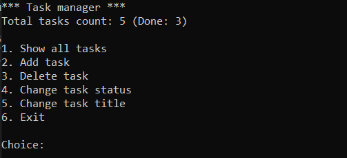

# Консольный менеджер задач (ToDo List) на C#

## Описание
Разработано консольное приложение для управления персональными задачами. Проект демонстрирует навыки объектно-ориентированного проектирования, обработки исключений, логирования, работы с файловой системой и JSON-сериализации.

## Функциональные возможности

* Добавление новой задачи.
* Просмотр всех задач с нумерацией и отметкой о выполнении.
* Удаление задачи по номеру.
* Изменение статуса (выполнено/не выполнено).
* Редактирование названия задачи.
* Сохранение и загрузка задач из JSON-файла.
* Логирование событий и ошибок в текстовый файл.
* Обработка пользовательского ввода с защитой от некорректных данных.

## Технологии и подходы

- Язык: C#
- Среда: .NET Console Application
- Сериализация: System.Text.Json (с форматированием для читаемости)
- Логирование: собственный интерфейс ILogger и реализация FileLogger

Обработка ошибок: иерархия пользовательских исключений:
* ToDoListException – базовый класс
* TaskNotFoundException – задача не найдена
* InvalidTaskDataException – некорректные данные (например, пустой заголовок)
* TaskOperationException – ошибки ввода-вывода при работе с файлами

## Пример использования

* Главное меню

* Список задач

